# 初中数学智能信息系统 —— 使用手册

> 适用版本：v1.0  
> 编写日期：2026年5月

---

## 目录

1. [系统概述](#1-系统概述)
2. [主界面介绍](#2-主界面介绍)
3. [侧边栏功能](#3-侧边栏功能)
4. [模块一：学情智能分析](#4-模块一学情智能分析)
   - [4.1 上传成绩](#41-上传成绩)
   - [4.2 AI 分析](#42-ai-分析)
   - [4.3 历史考试](#43-历史考试)
   - [4.4 个人学情](#44-个人学情)
5. [模块二：错题智能辅导](#5-模块二错题智能辅导)
   - [5.1 录入错题](#51-录入错题)
   - [5.2 错题本](#52-错题本)
   - [5.3 学习诊断](#53-学习诊断)
6. [模块三：智能出题组卷](#6-模块三智能出题组卷)
   - [6.1 配置题目要求](#61-配置题目要求)
   - [6.2 管理题目列表](#62-管理题目列表)
   - [6.3 生成试卷](#63-生成试卷)
   - [6.4 查看与导出试卷](#64-查看与导出试卷)
7. [Excel 成绩文件格式说明](#7-excel-成绩文件格式说明)
8. [常见问题](#8-常见问题)

---

## 1. 系统概述

**初中数学智能信息系统**是基于 DeepSeek 大模型的 AI 教学辅助平台，专为初中数学教师设计。系统包含三大核心功能模块：

| 模块 | 核心功能 | 典型使用场景 |
|------|----------|--------------|
| 学情智能分析 | 成绩上传 → AI 自动分析 → 可视化报告 → 导出 | 月考/期中考试后分析班级表现 |
| 错题智能辅导 | 拍照录入错题 → AI 识别 → 学习计划 → 复习提醒 | 日常错题整理与个性化辅导 |
| 智能出题组卷 | 配置知识点+难度+题型 → AI 逐题生成 → 导出 Word | 编制随堂练习/单元测试卷 |

系统覆盖湖北省天门市中考数学全部知识点分类，适用于初中数学教学的各个环节。

---

## 2. 主界面介绍

启动系统后，浏览器中会显示主界面，包含以下区域：
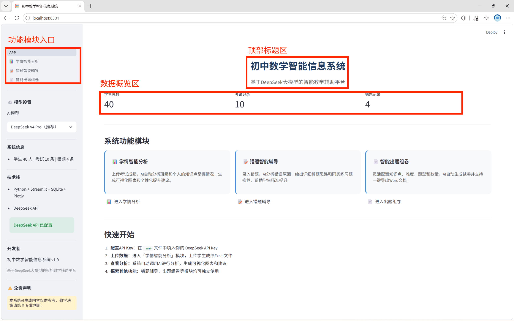

### 2.1 顶部标题区

页面顶部显示系统名称 **"初中数学智能信息系统"** 和副标题 **"基于DeepSeek大模型的智能教学辅助平台"**。


### 2.2 数据概览区

标题下方显示三个统计指标卡片：

- **学生总数**：系统中已录入的学生人数
- **考试记录**：已上传的考试次数
- **错题记录**：已录入的错题条数


### 2.3 功能模块入口

三个功能卡片，分别对应系统的三个模块：

- **📊 学情智能分析** — 点击"进入学情分析"跳转
- **📝 错题智能辅导** — 点击"进入错题辅导"跳转
- **📄 智能出题组卷** — 点击"进入出题组卷"跳转

### 2.4 快速入门指引

页面底部提供了简单的操作步骤说明，帮助新用户快速上手。

### 2.5 页面导航

左侧边栏顶部显示页面导航，可在三个功能模块之间切换。也可通过主界面的功能卡片进入。

---

## 3. 侧边栏功能

所有页面共用左侧侧边栏，包含以下信息：
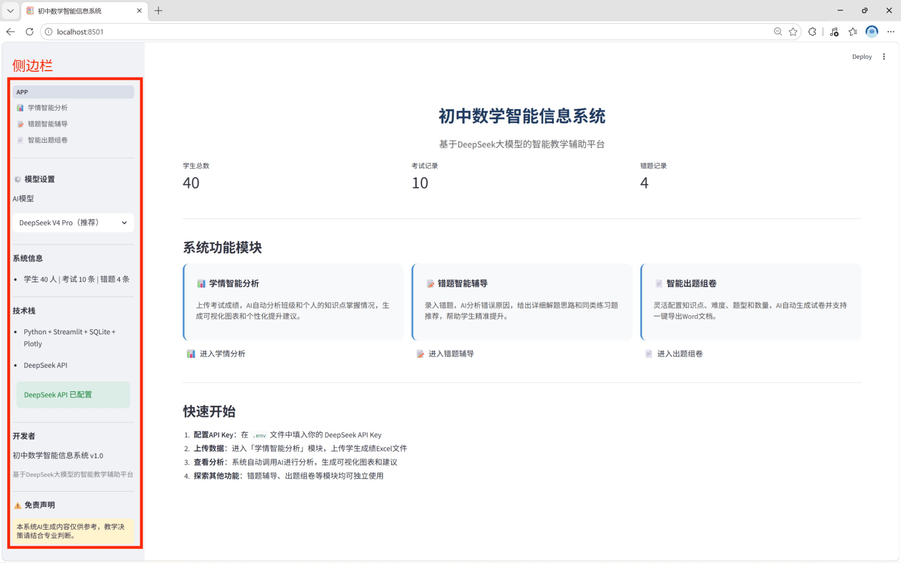

### 3.1 模型设置

可以选择 AI 模型：
- **DeepSeek V4 Pro（推荐）**：效果更好，适合正式使用
- **DeepSeek V4 Flash（经济）**：速度更快，费用更低，适合测试

### 3.2 系统信息

显示当前数据库中的统计数据：学生人数、考试记录数、错题记录数。

### 3.3 API 状态指示灯

- **绿色 "已配置"**：API 密钥有效，AI 功能可用
- **红色 "未配置"**：需要检查 `.env` 文件配置


### 3.4 技术栈与版本信息

显示系统使用的技术栈以及版本号。

### 3.5 免责声明

提醒用户 AI 生成内容仅供参考。

---

## 4. 模块一：学情智能分析

**功能概述**：上传学生考试成绩，AI 自动分析班级整体表现和知识点掌握情况，生成可视化图表和教学建议，支持导出 Word/PDF 报告。

该模块包含四个标签页：

### 4.1 上传成绩

**功能**：上传包含学生成绩的 Excel 文件，验证数据格式，保存到系统数据库。

**操作步骤**：

1. 在学情分析页面，确认当前选中的是 **"📤 上传成绩"** 标签页。
2. 点击 **"Browse files"** 按钮，选择要上传的 Excel 成绩文件（`.xlsx` 或 `.xls` 格式）。
3. 系统自动解析文件，显示以下内容：
   - 考试名称、班级、学生人数、满分
   - 题目信息表格（题号、题型、分值、考查知识点）
   - 学生成绩预览表格（姓名、各题得分）
4. 检查数据是否正确。如果文件缺少必要的 Sheet 或格式不符，系统会给出红色错误提示。
5. 确认无误后，点击 **"💾 保存成绩"** 按钮。
6. 系统会先检查是否存在同名考试（避免重复），然后逐条保存学生成绩数据，进度条显示保存进度。
7. 保存成功后显示绿色提示信息。

**支持批量上传**：可同时选择多个成绩文件上传，每个文件单独处理。

**数据校验**：系统会自动检查每道题的得分是否超过该题满分，如有异常会提示并中止保存。

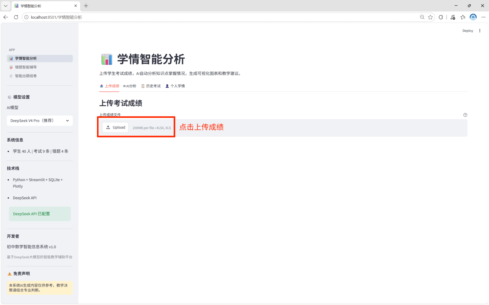
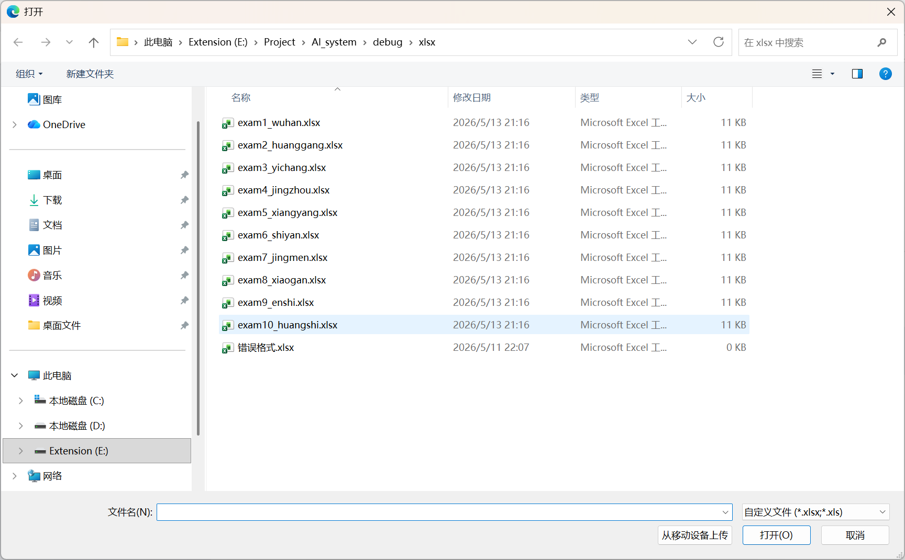
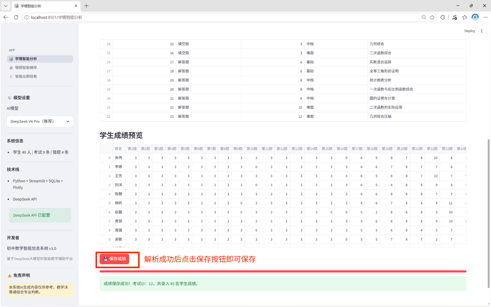

**Excel 文件格式要求**：

Excel 文件必须包含以下三个 Sheet（详见[第 7 节](#7-excel-成绩文件格式说明)）：
- **考试信息**：考试名称、班级、学生人数、满分等
- **题目信息**：题号、题型、分值、考查知识点等
- **学生成绩**：姓名、各题得分（列名为"第1题"、"第2题"……）

---

### 4.2 AI 分析

**功能**：对已保存的考试成绩进行可视化展示，并调用 AI 进行深度分析，生成教学建议报告。

**操作步骤**：

1. 切换到 **"🤖 AI分析"** 标签页。
2. 在下拉框中选择要分析的考试（格式为"考试名称 (日期) - 班级"）。
3. 系统自动展示以下统计信息和图表：
   - **三个指标**：平均分、最高分、最低分
   - **成绩分布直方图**：展示各班分数段分布
   - **知识点掌握率雷达图**：各知识点的平均得分率
   - **知识点详细数据表**：每个知识点的平均得分、满分、掌握率
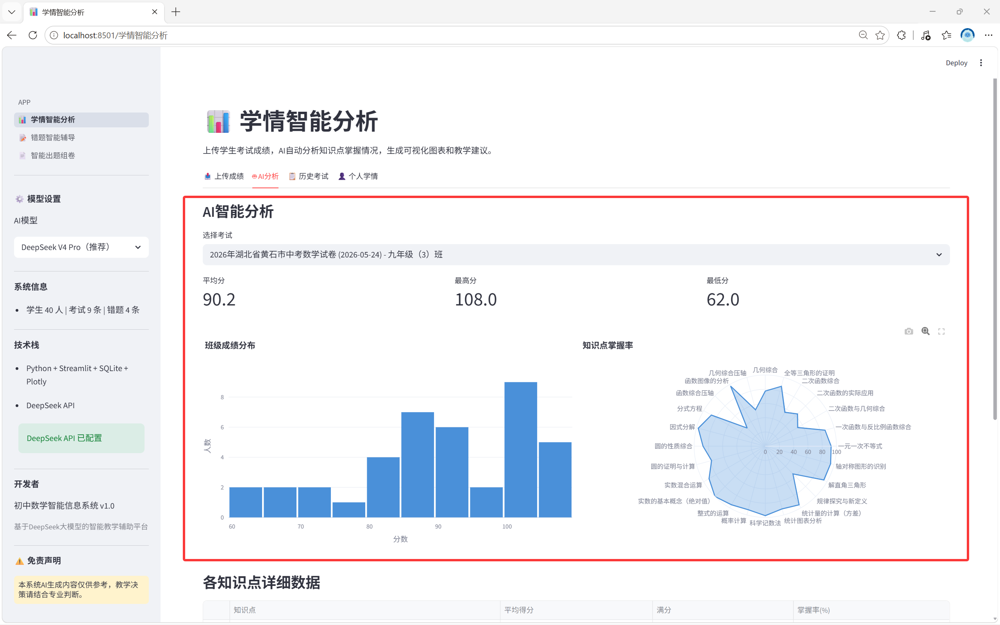

4. 点击 **"🤖 启动AI深度分析"** 按钮。
5. 系统调用 DeepSeek API 进行分析（约需数十秒），分析完成后显示 AI 报告，包含：
   - **班级整体情况**：全班表现的文字总结
   - **薄弱知识点**：列出需要加强的知识点及其分析
   - **教学建议**：针对性的教学改进建议
   - **优秀学生/需要关注的学生**：AI 根据成绩自动分层

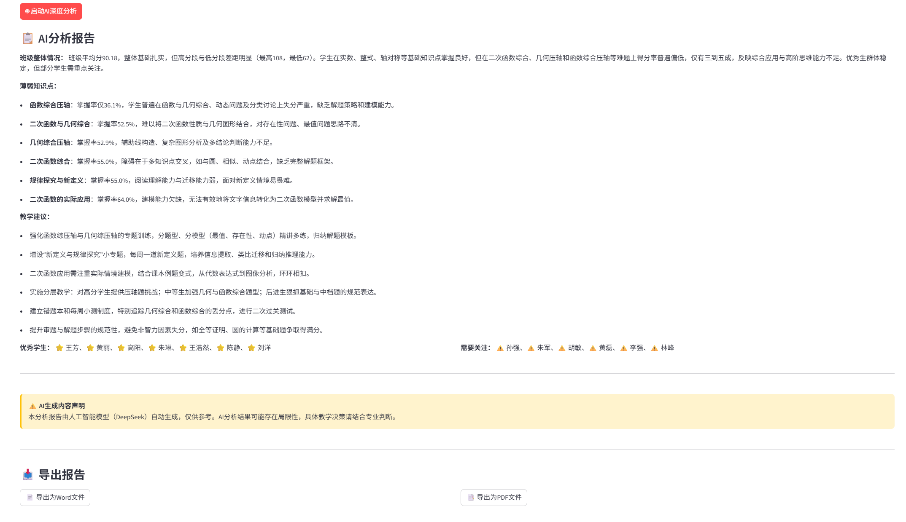

6. AI 分析结果会缓存（切换页面不丢失），可在此页面直接查看。

**导出报告**：

分析完成后，页面底部显示导出按钮：
- **📄 导出为 Word 文件**：生成 `.docx` 格式报告
- **📑 导出为 PDF 文件**：生成 `.pdf` 格式报告


报告内容含封面标题、班级整体情况、薄弱知识点分析、教学建议、优秀/需关注学生名单、知识点详情表格、AI 免责声明。

---

### 4.3 历史考试

**功能**：查看所有已上传的考试记录，支持查看详情和删除。

**操作步骤**：

1. 切换到 **"📋 历史考试"** 标签页。
2. 系统以可展开列表显示所有历史考试记录。

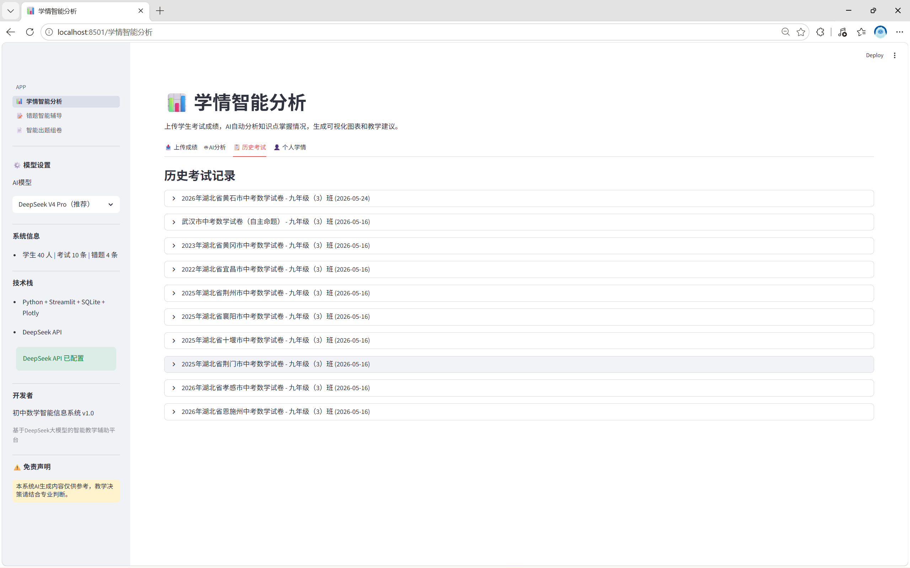

3. 点击任一条目展开，显示：
   - 参考人数、平均分、最高分
   - 全班学生成绩排名表格

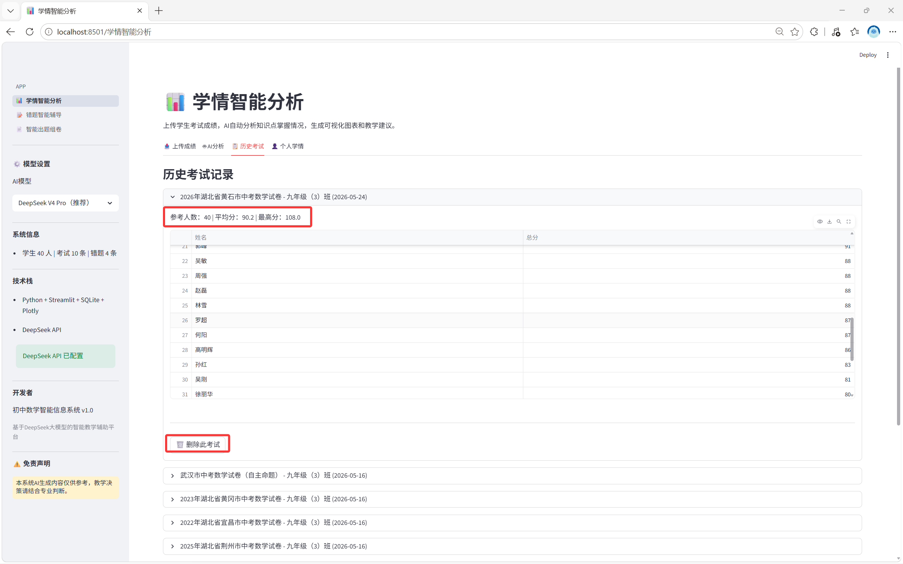

4. 如需删除，点击底部的 **"🗑️ 删除此考试"** 按钮。注意：删除考试会同时删除对应的所有成绩数据，不可恢复。

---

### 4.4 个人学情

**功能**：查看单个学生的历次考试成绩趋势、知识点掌握情况，AI 生成个性化评语。

**操作步骤**：

1. 切换到 **"👤 个人学情"** 标签页。
2. 在下拉框中选择要查看的学生（支持按姓名和班级筛选）。
3. 系统自动加载该学生的所有考试成绩数据。

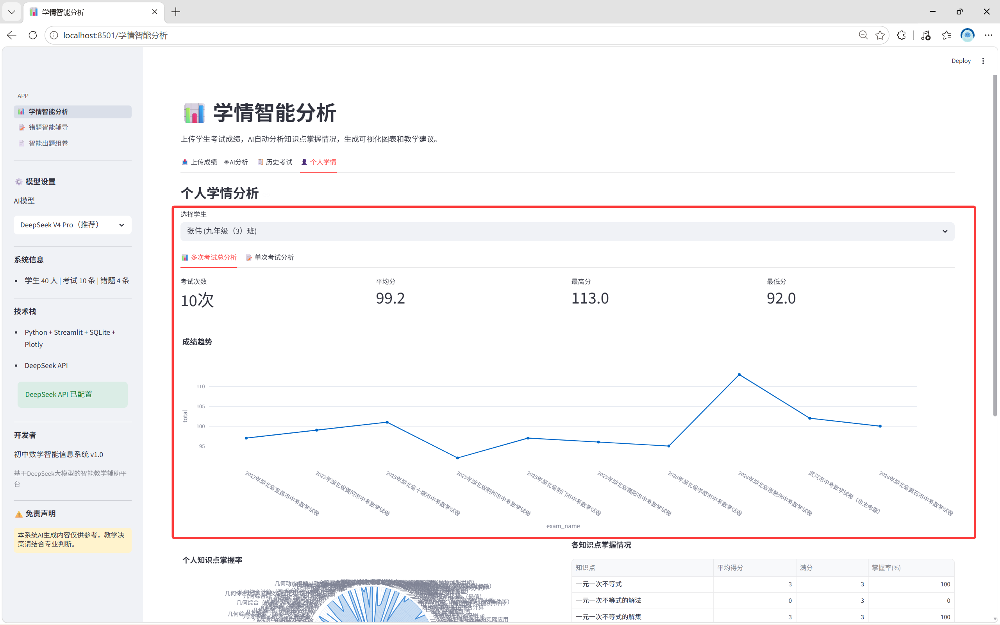

个人学情包含两个子标签页：

#### 子标签一：📊 多次考试总分析

- **四个指标**：考试次数、历史平均分、最高分、最低分
- **成绩趋势折线图**：展示该生历次考试成绩变化（需至少 2 次考试）
- **知识点掌握率雷达图**：展示该生各知识点的综合掌握情况
- **知识点详情表格**：每个知识点的平均得分和掌握率

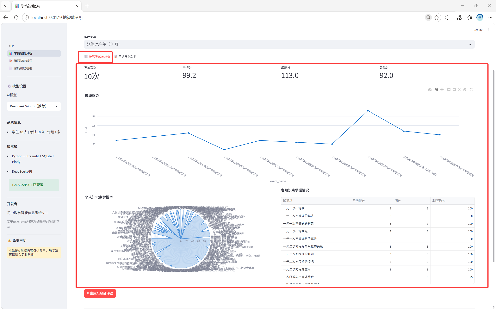

- **AI 综合评语**：点击 **"🤖 生成AI综合评语"** 按钮，AI 根据该生的历次成绩趋势和知识点掌握情况生成学期综合评语。

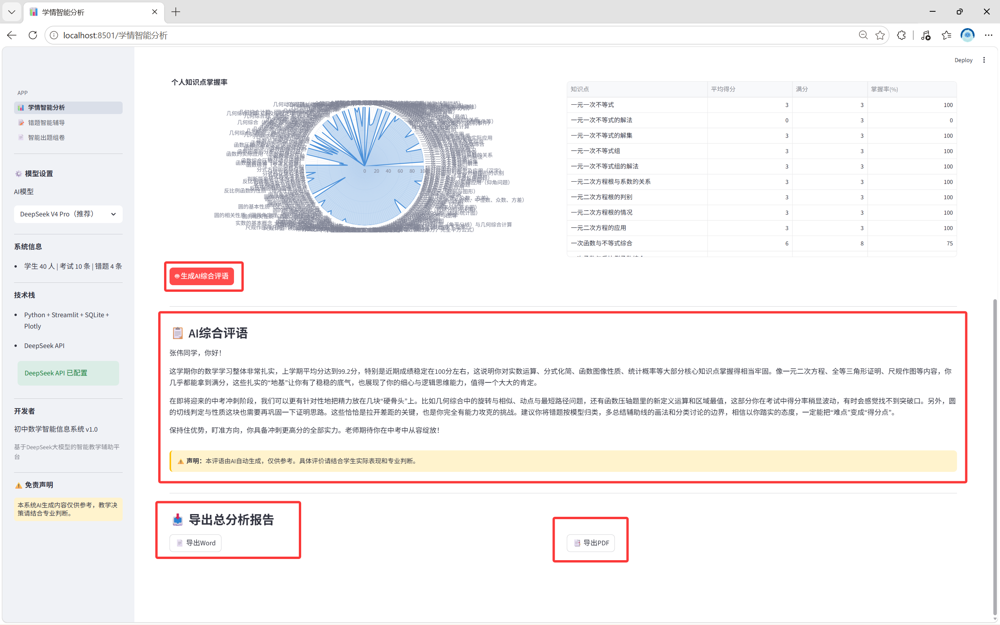

- **导出总分析报告**：可将分析结果导出为 Word 或 PDF。

#### 子标签二：📝 单次考试分析

- 选择具体某次考试。
- 显示：本次总分、题目数、总得分率。
- **各题得分详情表格**：包含题号、知识点、得分、满分、得分率。
- **知识点掌握雷达图**：该次考试的知识点掌握情况。

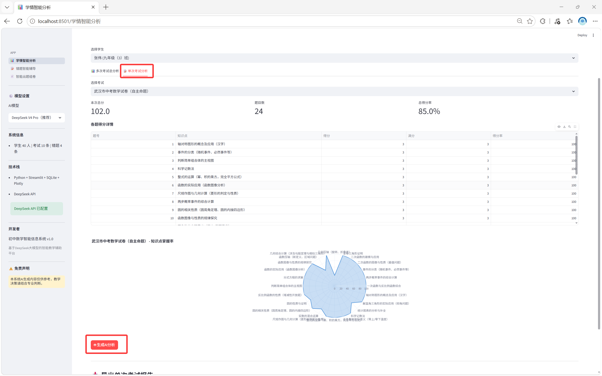

- **AI 考试分析**：点击 **"🤖 生成AI分析"** 按钮，AI 生成针对该次考试的详细分析。
- **导出单次考试报告**：支持 Word/PDF。

---

## 5. 模块二：错题智能辅导

**功能概述**：拍照录入学生错题，AI 自动识别题目信息；管理错题本；AI 生成个性化学习计划和智能复习提醒。

### 5.1 录入错题

**操作步骤**：

1. 进入错题辅导页面后，首先在顶部选择或输入学生信息：
   - 如果已有学生数据，从下拉框中选择
   - 也可以选择"手动输入新学生"，填写姓名和班级
2. 切换到 **"➕ 录入错题"** 标签页。
3. 点击 **"Browse files"** 上传错题照片（支持 JPG/PNG 格式，单个文件不超过 10MB）。

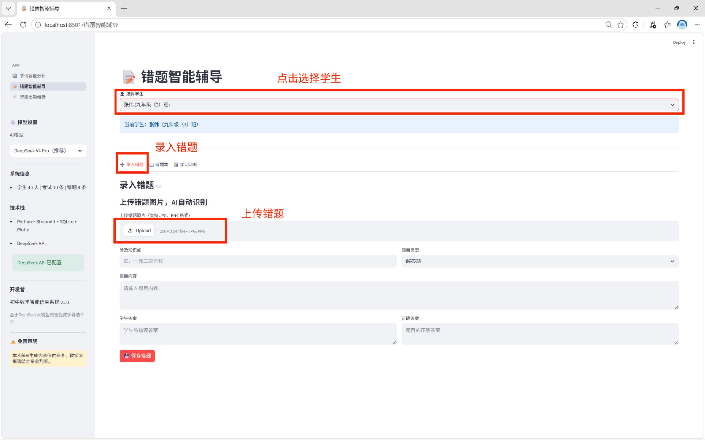

4. 上传后，照片会显示在页面上。点击 **"🤖 AI识别题目"** 按钮。
5. 系统先通过 OCR 提取照片中的文字，再由 AI 解析为结构化信息。识别过程显示实时计时器。

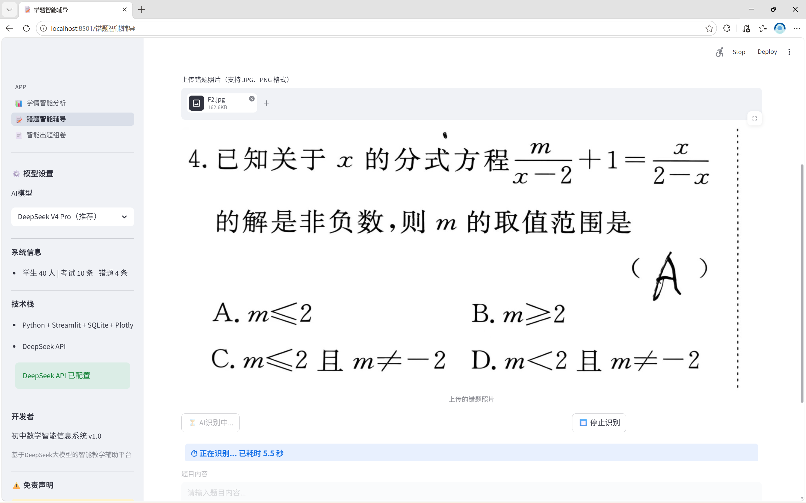

6. 识别完成后，表单自动填入 AI 识别结果：
   - **涉及知识点**：如"一元二次方程"
   - **题目类型**：选择题/填空题/解答题/判断题
   - **题目内容**：AI 整理的题目文字
   - **学生答案**：学生写错的内容
   - **正确答案**：AI 识别的正确答案

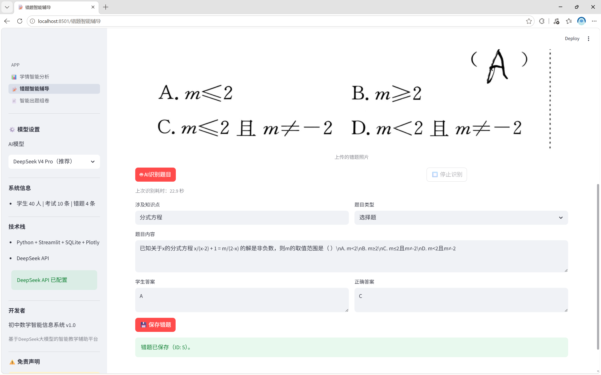

7. 人工检查并修正识别结果（OCR 对图片质量有要求，手写字识别率可能较低）。
8. 点击 **"💾 保存错题"** 按钮保存。

**重复检测**：系统会自动检测是否与已有错题重复（基于文字相似度）。如果重复，不会新增记录，而是将已有记录的"错误次数"+1。

**停止识别**：如果 AI 识别耗时过长，可以点击"⏹️ 停止识别"按钮终止。

---

### 5.2 错题本

**功能**：查看和管理学生所有错题记录，支持按知识点筛选和可视化统计。

**操作步骤**：

1. 确保顶部已选择学生。
2. 切换到 **"📖 错题本"** 标签页。
3. **按知识点筛选**：在下拉框中选择特定知识点（或保持"全部"）。
4. 顶部显示统计：共 X 条错题，累计错误 Y 次。
5. 两张统计图表：
   - **知识点分布饼图**：各知识点的错题占比
   - **错误类型分布柱状图**：各错误类型的统计

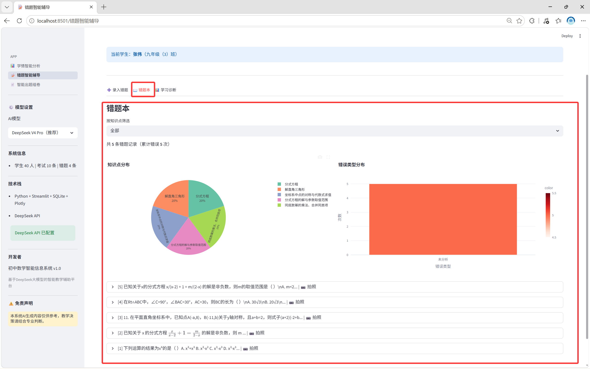

6. 错题列表以可展开形式显示，每条记录包含：

   - 题目 ID 和内容摘要
   - 来源标签（📷 拍照 / ✏️ 手动 / 📋 考试）
   - 错误次数标记（如 ×3 表示错了 3 次）
   - 展开后可查看：完整题目、学生答案、正确答案、知识点、错误类型、录入时间
   - **"🗑️ 删除"** 按钮可删除该条记录

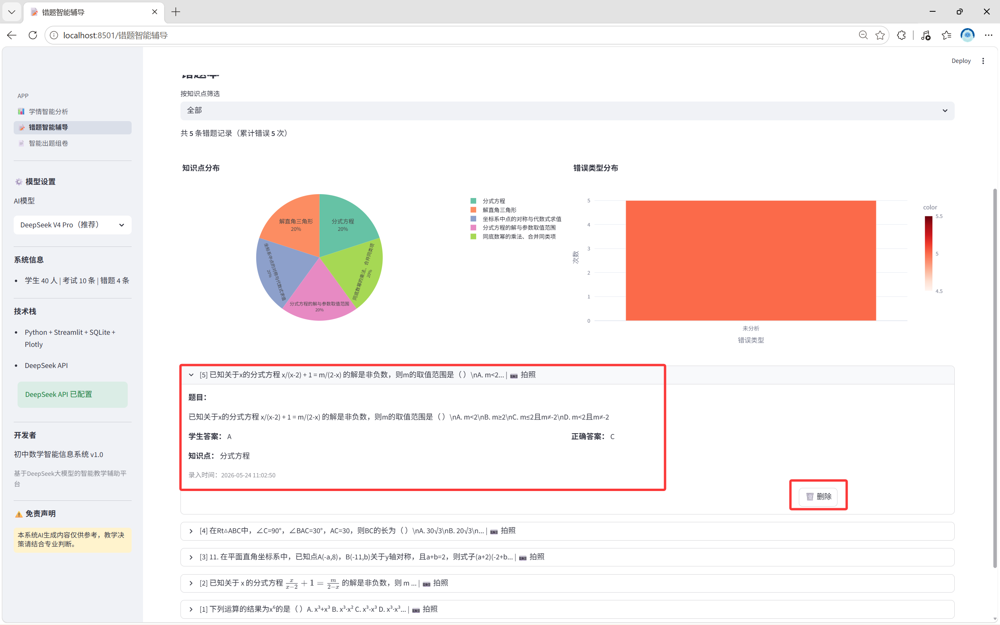

---

### 5.3 学习诊断

**功能**：AI 根据错题记录生成个性化学习计划 + 艾宾浩斯遗忘曲线智能复习提醒。

**操作步骤**：

1. 确保顶部已选择学生。
2. 切换到 **"📊 学习诊断"** 标签页。

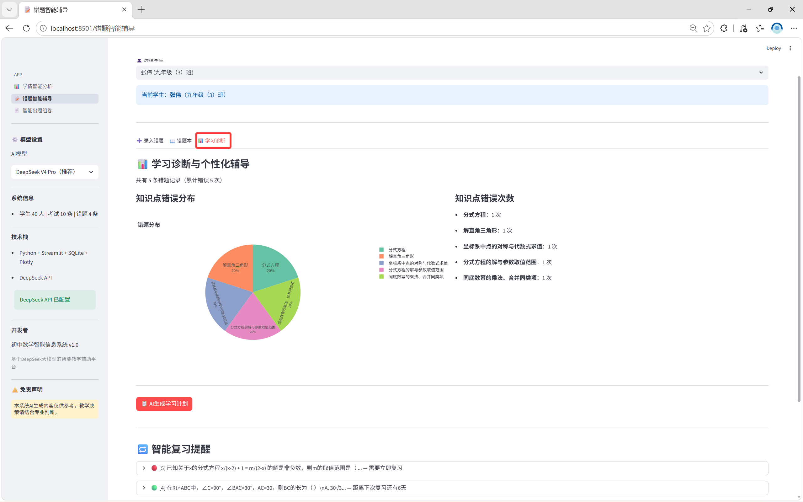

3. 系统展示：
   - 错题总数统计
   - **知识点错误分布饼图**
   - **知识点错误次数排行榜**（Top 5）

#### AI 生成学习计划

4. 点击 **"📋 AI生成学习计划"** 按钮。
5. AI 分析错题数据后生成包含以下内容的个性化学习计划：
   - **每周学习目标**：分周展示，含重点知识点和预计学习时间
   - **每日复习安排**：具体的每日复习指导
   - **学习资源推荐**：针对性的学习材料建议
   - **阶段性里程碑**：学习成果的检查节点和目标时间

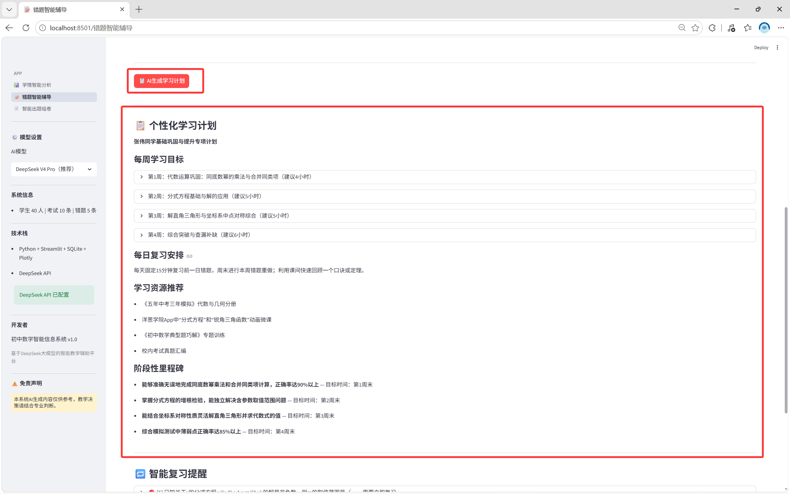

#### 智能复习提醒

6. 系统基于**艾宾浩斯遗忘曲线**（1天/3天/7天/14天/30天间隔），为每条错题计算复习时间：
   - **🔴 红色**：需要立即复习（逾期 1 天内）
   - **🟡 黄色**：即将到期（1-3 天内需复习）
   - **🟢 绿色**：距离下次复习还有 X 天 / 已完成所有周期

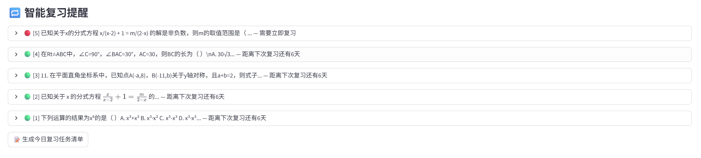

7. 每条记录可展开查看题目详情、正确答案和知识点。

#### 生成今日复习任务清单

8. 点击 **"📝 生成今日复习任务清单"** 按钮。
9. AI 根据各错题的录入时间和知识点关联性，生成今日复习任务：
   - 复习任务列表（错题编号、建议复习方式、预计时间）
   - 总预计时间
   - 综合复习建议

---

## 6. 模块三：智能出题组卷

**功能概述**：灵活配置知识点、难度、题型和数量，AI 逐题生成试卷内容，支持导出学生版和教师版 Word 文档。

### 6.1 配置题目要求

**操作步骤**：

1. 进入出题组卷页面。
2. 输入 **"试卷标题"**（如"九年级数学一元二次方程测试"）。
3. 在"设置题目要求"区域，配置以下四项参数：

| 参数 | 说明 | 选项 |
|------|------|------|
| 知识类别 | 四大学科领域 | 数与代数 / 空间与图形 / 统计与概率 / 综合与实践 |
| 知识点 | 所选类别下的具体知识点 | 共 55 个中考知识点可选用 |
| 难度 | 1-5 星级 | 1（最简单）~ 5（最困难） |
| 题型 | 题目类型 | 选择题 / 填空题 / 解答题 |
| 数量 | 该配置项需要生成的题目数 | 1-5 道 |

4. 填写完成后，点击 **"➕ 添加到试卷"**。
5. 配置将添加到下方的题目列表中。

**知识类别切换联动**：切换知识类别时，知识点选项会自动更新为该类别下的知识点。
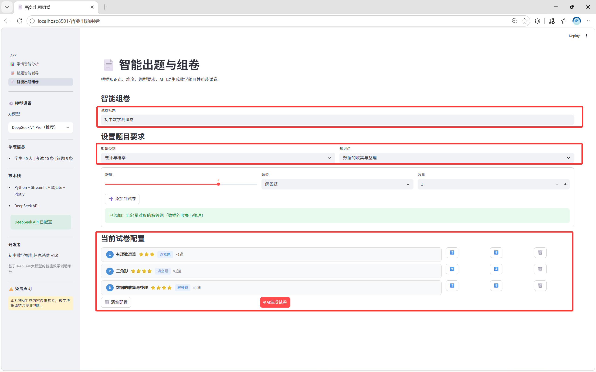
### 6.2 管理题目列表

添加后的配置项以蓝色序号卡片形式展示，每个卡片显示：
- 序号、知识点名称、难度星级、题型标签、数量
每个卡片右侧有三个操作按钮：
- **⬆️ 上移**：将此配置项在试卷中向前调整位置
- **⬇️ 下移**：将此配置项在试卷中向后调整位置
- **🗑️ 删除**：移除此配置项

最下方提供：
- **🗑️ 清空配置**：清除所有已添加的题目配置
- **🤖 AI生成试卷**：开始生成（总题目数不超过 20 道）

### 6.3 生成试卷

**操作步骤**：

1. 确认题目配置无误后，点击 **"🤖 AI生成试卷"** 按钮。
2. 系统显示生成进度条和实时计时器。
3. AI 逐道生成题目，每道题调用一次 API。进度实时更新：

   ```
   进度：3/10 | 已用时：45秒
   ```
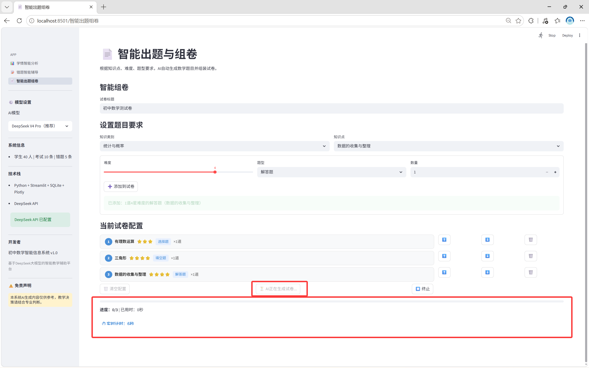
4. 支持 **"⏹️ 终止"** 操作：随时停止生成，已生成的题目会保留。
5. 生成中断时，已生成的题目会立即展示，可点击"继续生成"补全剩余题目。

6. 全部完成后显示：**"✅ 试卷生成完成，共 X 道题，最终用时 XX秒"**。

**题目数量限制**：单张试卷总题目数不超过 20 道，超出时系统会提示。

### 6.4 查看与导出试卷

**查看试卷**：

生成完成后，试卷题目以**左右并排布局**展示：
- **左侧**：题目内容（含题号、题型、题目文字、选项）
- **右侧**：答案与解析（含知识点、正确答案、详细解析步骤）

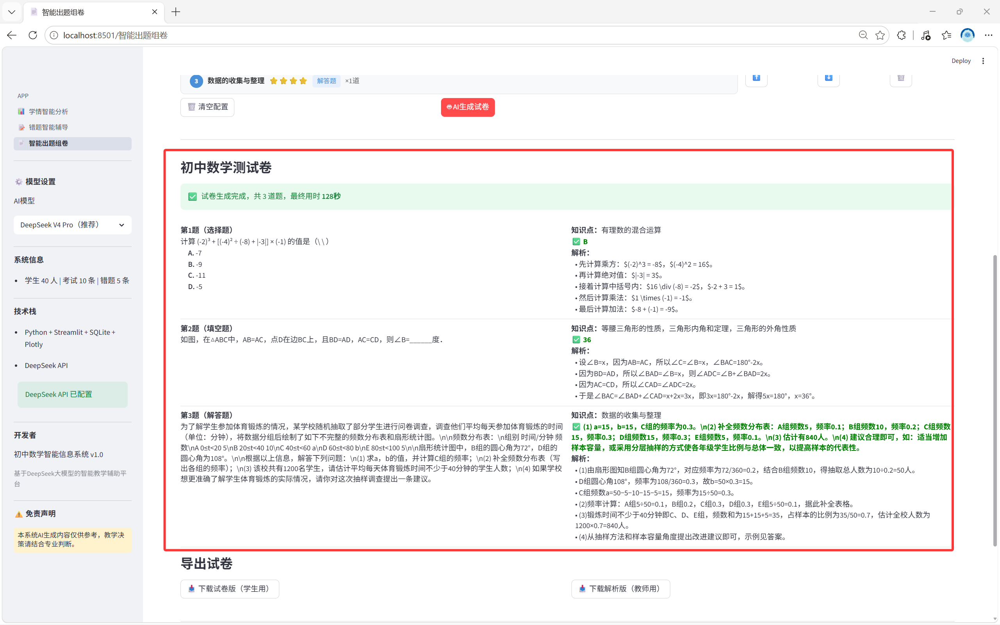

**导出试卷**：

页面底部提供两个导出按钮：

- **📥 下载试卷版（学生用）**：仅含题目，不含答案和解析，可直接打印给学生作答
- **📥 下载解析版（教师用）**：含题目 + 答案 + 解析，供教师参考

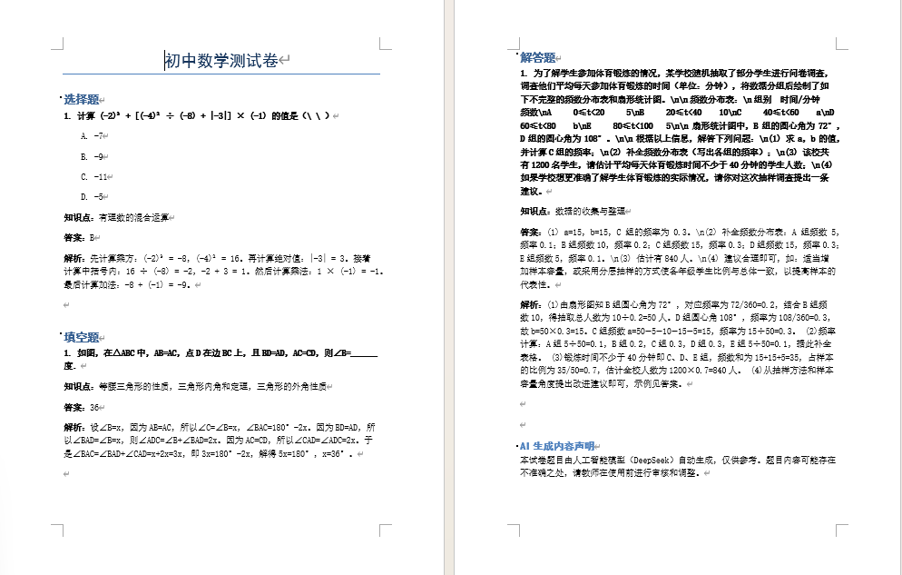
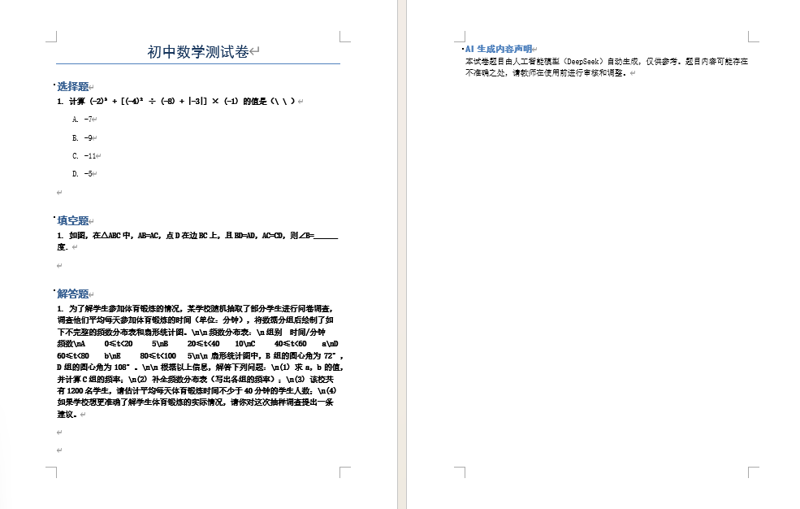
导出的 Word 文档包含：
- 居中标题（黑体大字）
- 按题型分组的题目列表（宋体，含选项 ABCD）
- 解析版额外包含：知识点标注、正确答案（绿色标注）、分步解析
- 末页 AI 生成内容声明

---

## 7. Excel 成绩文件格式说明

上传的成绩 Excel 文件需严格按照以下格式准备。

### Sheet 1：考试信息

| 项目 | 内容 |
|------|------|
| 考试名称 | 期中考试 |
| 班级 | 九年级（3）班 |
| 学生人数 | 40 |
| 满分 | 120 |
| …… | …… |

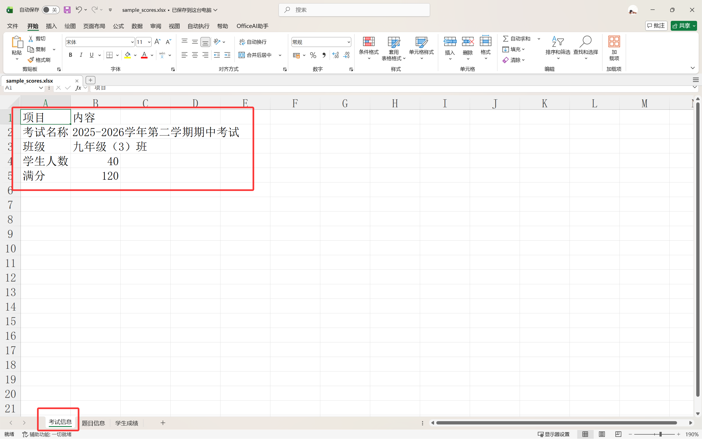

### Sheet 2：题目信息

| 题号 | 题型 | 分值 | 考查知识点 |
|------|------|------|------------|
| 1 | 选择题 | 3 | 有理数运算 |
| 2 | 选择题 | 3 | 实数运算 |
| 3 | 填空题 | 4 | 一元一次方程 |
| …… | …… | …… | …… |

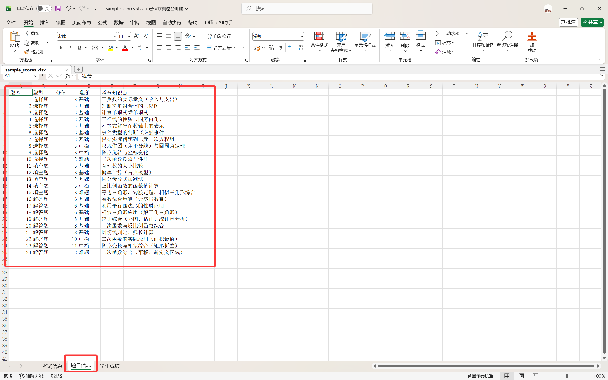

### Sheet 3：学生成绩

| 姓名 | 第1题 | 第2题 | 第3题 | …… |
|------|-------|-------|-------|-----|
| 张三 | 3 | 3 | 2 | …… |
| 李四 | 3 | 0 | 4 | …… |
| …… | …… | …… | …… | …… |

- 姓名列不能为空。
- 各题得分列必须命名为"第X题"格式（X 为题号）。
- 每道题的得分不能超过该题满分。

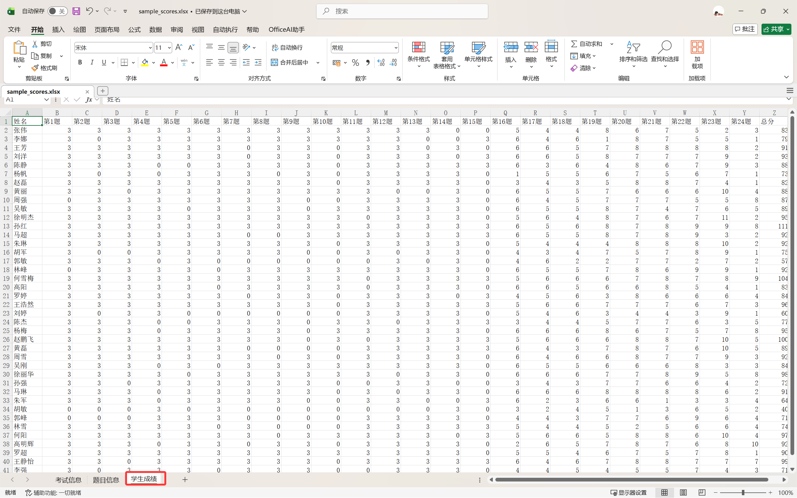

**获取示例文件**：运行 `python demo/create_sample_data.py` 可生成一份符合格式的示例 Excel 文件。

---

## 8. 常见问题

### Q1：上传 Excel 时提示"缺少必要的 Sheet"

**原因**：Excel 文件中的 Sheet 命名不匹配。

**解决**：确认三个 Sheet 分别命名为"考试信息""题目信息""学生成绩"（中文，完全一致）。不要使用其他名称。

### Q2：OCR 识别不准

**原因**：图片质量不佳或文字为手写体。

**解决**：
- 确保拍照清晰、光线充足、文字正对镜头。
- 手写字体的识别率低于印刷体。
- 识别不准时可直接手动修改表单中的内容（识别结果仅作为填充，可自由修改）。
- 纯手写题目建议直接手动填写。

### Q3：AI 分析/生成速度慢

**原因**：API 调用需要时间，尤其在生成复杂内容时。

**解决**：
- 可在侧边栏切换为"DeepSeek V4 Flash"模型，速度更快，费用更低。
- 出题组卷时如中途不满意可点击"终止"。
- 一次生成过多题目时建议分批配置。

### Q4：试卷生成到一半中断了

**原因**：网络波动或 API 临时故障。

**解决**：已生成的题目会保留在页面上，未生成的题目可以重新配置后再次生成。建议检查网络后重试。

### Q5：生成的题目不够好

**原因**：AI 出题质量受提示词影响。

**解决**：
- 可以重新点击生成，每次结果可能不同。
- 导出 Word 后可在 Word 中直接编辑修改。
- 试卷版和解析版均可二次加工。

### Q6：错题录入后找不到记录

**原因**：选择的学生不匹配。

**解决**：确认在页面顶部选择了正确的学生。错题是按学生关联的，切换学生后只能看到该生的错题。

### Q7：个人学情分析不显示趋势图

**原因**：该学生只有一次考试记录，无法生成趋势图。

**解决**：趋势图需要至少 2 次考试数据才能展示，这是正常现象。录入更多考试记录后即可显示。

### Q8：如何备份数据

系统数据存储在 `data/math_system.db` 文件中。备份方法：
1. 关闭应用。
2. 复制 `data/math_system.db` 文件到安全位置。
3. 如需恢复，将该文件放回原位即可。

---

> **提示**：本系统所有 AI 生成内容（分析报告、学习计划、试卷题目等）均由人工智能模型自动生成，仅供参考。教学决策请结合教师专业判断。
