# 初中数学智能信息系统 —— 安装手册

> 适用版本：v1.0  
> 适用系统：Windows 10/11  
> 编写日期：2026年5月

---

## 目录

1. [系统要求](#1-系统要求)
2. [第一步：安装 Python](#2-第一步安装-python)
3. [第二步：下载项目文件](#3-第二步下载项目文件)
4. [第三步：安装依赖包](#4-第三步安装依赖包)
5. [第四步：配置 DeepSeek API 密钥](#5-第四步配置-deepseek-api-密钥)
6. [第五步：生成示例数据（推荐）](#6-第五步生成示例数据推荐)
7. [第六步：启动应用](#7-第六步启动应用)
8. [第七步：停止应用](#8-第七步停止应用)
9. [常见问题排查](#9-常见问题排查)

---

## 1. 系统要求

| 项目 | 最低要求 | 推荐配置 |
|------|----------|----------|
| 操作系统 | Windows 10 | Windows 11 |
| 内存 | 4 GB | 8 GB 及以上 |
| 硬盘空间 | 2 GB 可用空间 | 5 GB 可用空间 |
| 网络 | 需联网（调用 AI 接口） | 稳定宽带网络 |
| Python | 3.10 及以上 | 3.12 |

本系统不依赖 GPU，普通办公电脑即可运行。

---

## 2. 第一步：安装 Python

推荐使用 **Anaconda（conda）** 管理 Python 环境，方便后续维护。如果你希望使用更简单的方式，也可以选择直接安装 Python。

### 方式一：安装 Anaconda（推荐）

Anaconda 是 Python 数据科学发行版，自带包管理和环境管理功能，非常适合运行本项目。

#### 2.1 下载 Anaconda

1. 打开浏览器，访问 Anaconda 官网：**https://www.anaconda.com/download**
2. 点击 **"Download"** 按钮下载 Windows 安装包（约 800MB）。
3. 等待下载完成。

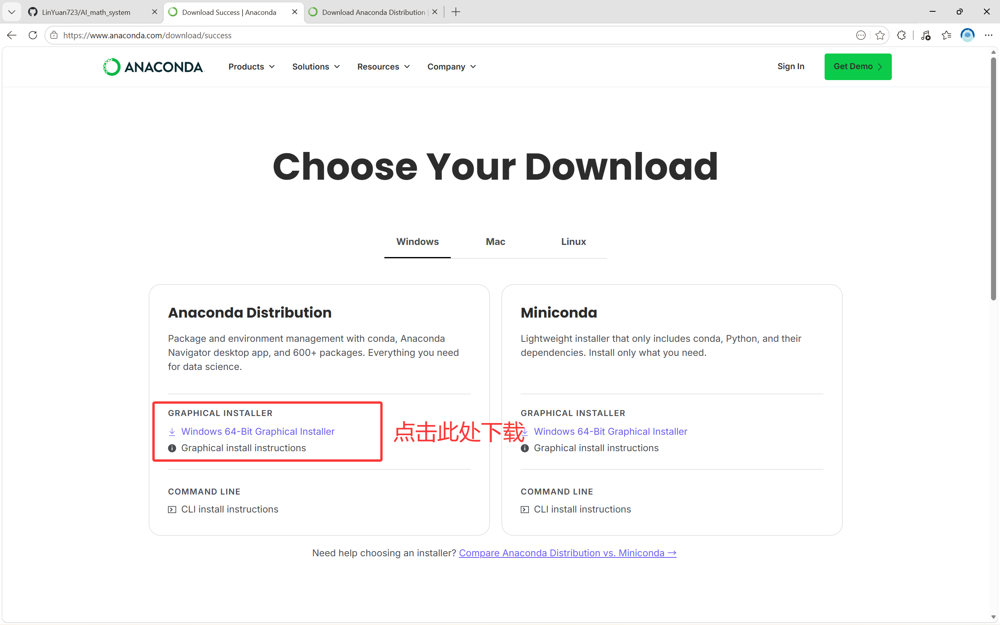

#### 2.2 安装 Anaconda

1. 双击下载的安装包（文件名类似 `Anaconda3-2024.xx-Windows-x86_64.exe`）。
2. 按默认选项一路 **"Next"**，安装路径保持默认即可（`C:\Users\你的用户名\anaconda3`）。
3. **重要：在 "Advanced Options" 页面，勾选 "Add Anaconda to my PATH environment variable"**（虽然安装程序会提示不建议，但对于本项目来说是必要的）。
4. 点击 **"Install"**，等待安装完成（约 5-10 分钟）。

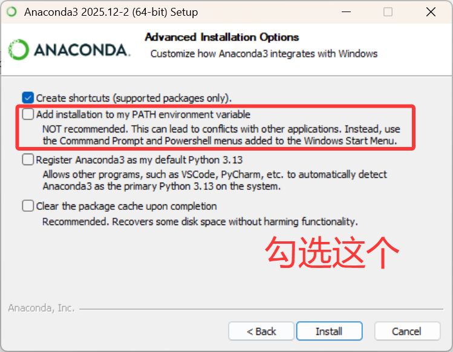

#### 2.3 验证安装

1. 按键盘 `Win`，输入 `anaconda powershell`，按回车打开命令提示符。
2. 输入以下命令验证 conda 是否安装成功：

```bash
conda --version
```

如果显示类似 `conda 24.x.x` 的信息，说明安装成功。

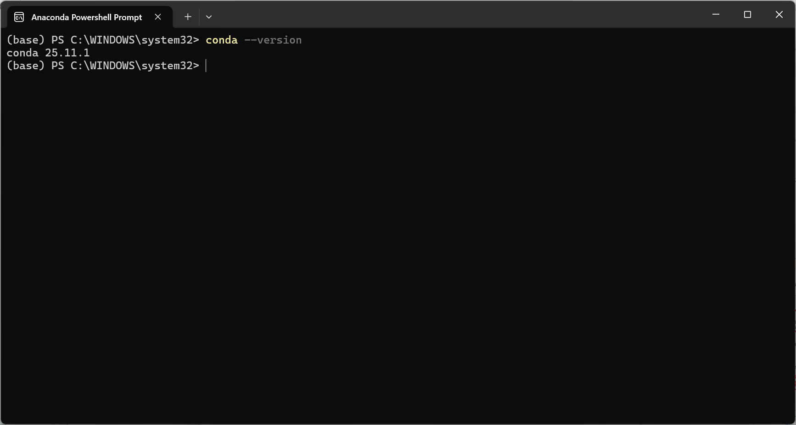

#### 2.4 创建虚拟环境

使用 conda 创建本项目专用的虚拟环境，避免与系统其他 Python 项目冲突：

```bash
conda create -n AI_system python=3.12
```

创建过程中会提示确认，输入 `y` 并回车。等待环境创建完成。

#### 2.5 激活虚拟环境

以后每次使用本项目前，都需要先激活这个虚拟环境：

```bash
conda activate AI_system
```

激活成功后，命令行左侧会显示 `(AI_system)` 前缀。

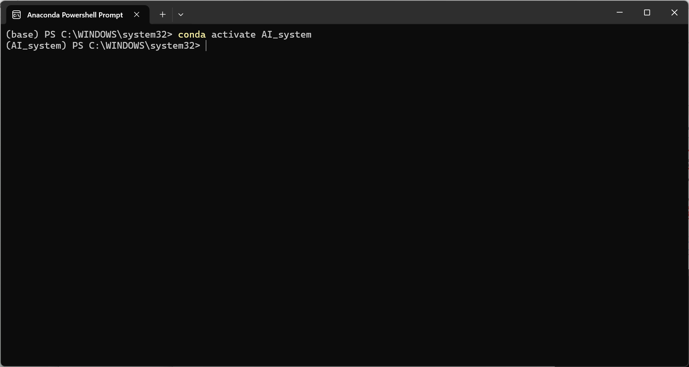

> ⚠️ **重要**：每次启动应用前都需要执行 `conda activate AI_system` 激活环境。

---

### 方式二：直接安装 Python（简单）

如果你不想安装 Anaconda，也可以直接安装 Python。

#### 2.1 下载 Python

1. 打开浏览器，访问 Python 官网：**https://www.python.org/downloads/**
2. 点击黄色按钮 **"Download Python 3.x.x"** 下载最新版本的安装包。

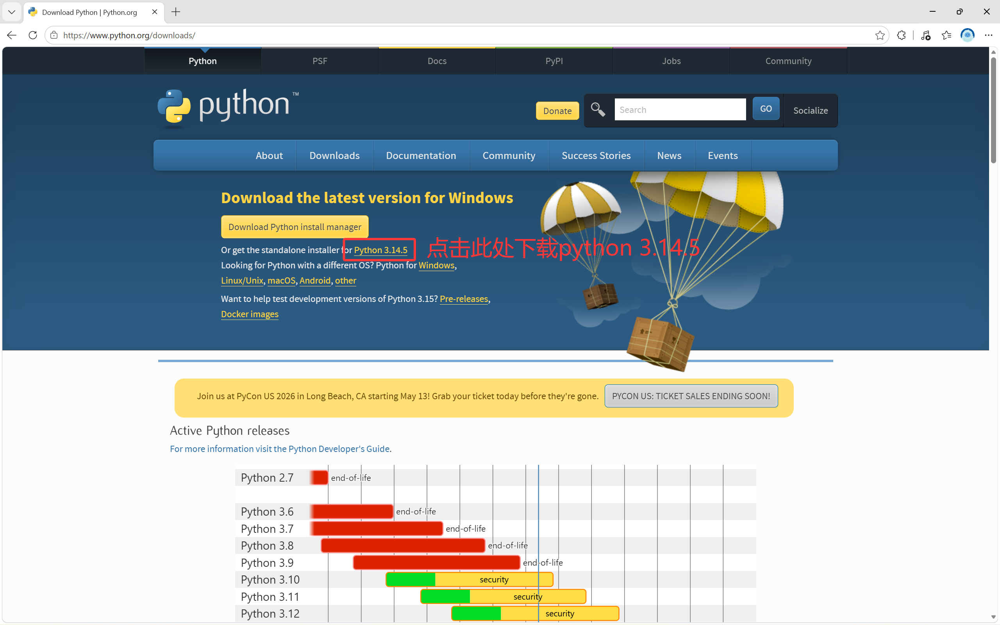

#### 2.2 安装 Python

1. 双击下载的安装包（文件名类似 `python-3.12.x-amd64.exe`）。
2. **重要：务必勾选底部的 "Add Python to PATH"**，否则后续命令行无法识别 Python。

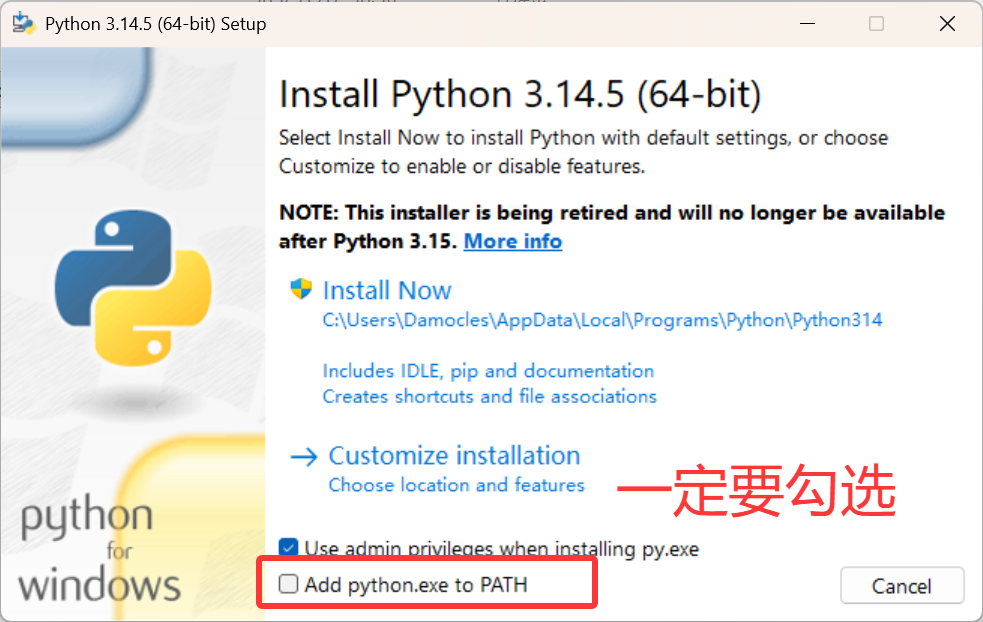

3. 点击 **"Install Now"**，等待安装完成。
4. 安装完成后，点击 **"Close"** 关闭安装程序。

#### 2.3 验证安装

1. 按键盘 `Win + R`，输入 `cmd`，按回车打开命令提示符（黑色窗口）。
2. 输入以下命令后回车：

```bash
python --version
```

如果显示类似 `Python 3.12.x` 的信息，说明安装成功。

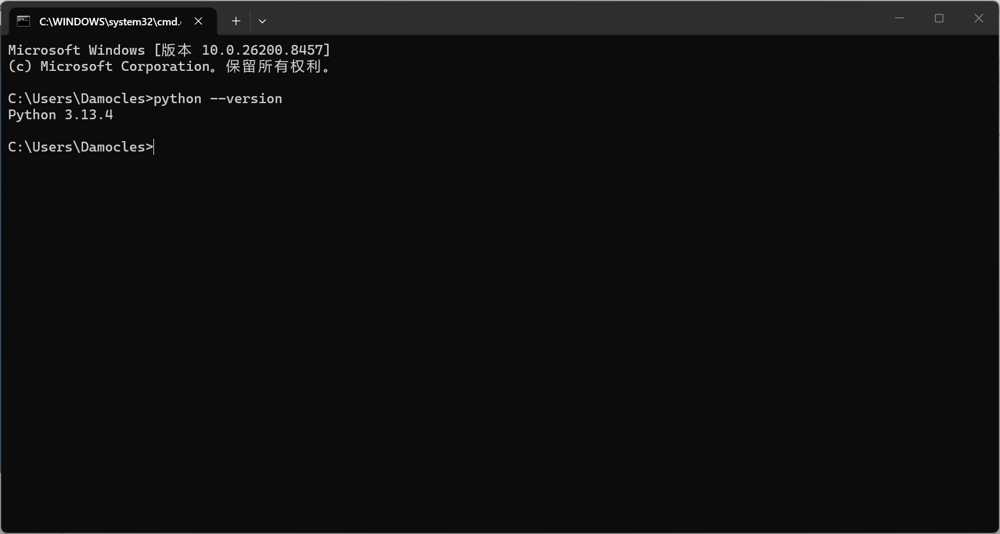

---

## 3. 第二步：下载项目文件

### 方式一：下载 ZIP 压缩包（推荐新手使用）

1. 打开浏览器，访问项目仓库地址。
2. 点击绿色 **"Code"** 按钮，选择 **"Download ZIP"**。

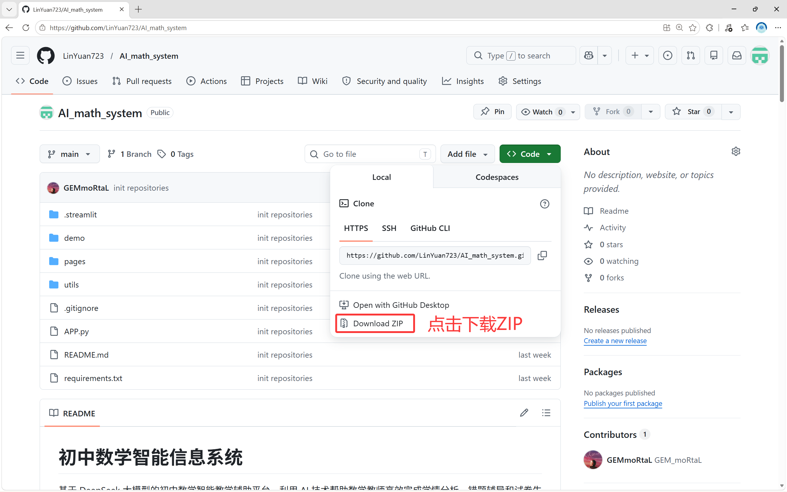

3. 下载完成后，将 ZIP 文件解压到你想要的文件夹（如 `D:\AI_math_system` 或桌面）。

### 方式二：使用 Git 命令（适合有编程经验的用户）

```bash
git clone https://github.com/GEMmoRtaL/AI_math_system.git
```

### 解压后的文件夹结构

解压后，你会看到以下文件和文件夹：

```
AI_math_system/
├── APP.py              ← 主程序入口
├── requirements.txt    ← 依赖列表
├── .env                ← API 密钥配置文件
├── pages/              ← 功能页面
├── utils/              ← 工具模块
├── demo/               ← 示例数据生成脚本
└── data/               ← 数据存储目录
```

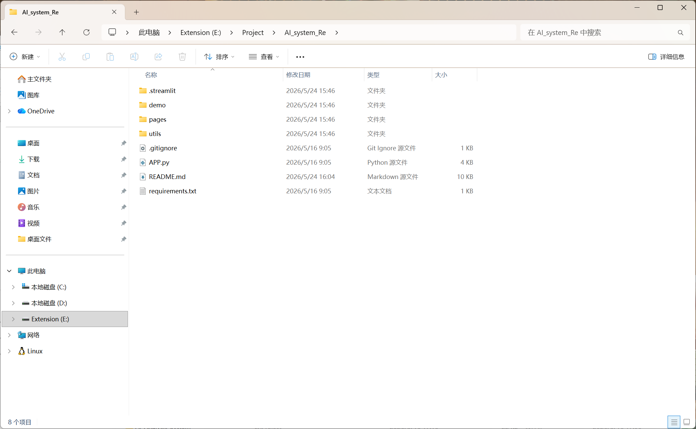

---

## 4. 第三步：安装依赖包

### 如果你使用了 Anaconda（激活虚拟环境）

在安装依赖前，请确保已激活虚拟环境：

```bash
conda activate AI_system
```


### 4.1 打开命令提示符

1. 打开项目文件夹（能看到 `APP.py` 的那个文件夹）。
2. 在文件夹地址栏中输入 `cmd` 并回车，命令提示符会自动定位到当前目录。

### 4.2 执行安装命令

在命令提示符中输入以下命令并回车：

```bash
pip install -r requirements.txt
```

安装过程大约需要 3-10 分钟，具体取决于网络速度。你会看到类似下面的进度信息：

```
Collecting streamlit>=1.57.0
  Downloading streamlit-1.57.0-py3-none-any.whl ...
Collecting pandas>=3.0.0
  ...
Successfully installed streamlit-... pandas-... ...
```

### 4.3 验证依赖安装

输入以下命令验证关键依赖是否安装成功：

```bash
pip list
```

确认列表中包含 `streamlit`、`pandas`、`plotly`、`openai` 等包。

### 如果安装失败

- 检查网络连接是否正常。
- 如果出现 `pip` 不是内部命令的错误，说明 Python 安装时没有勾选 "Add Python to PATH"，请重新安装 Python。
- 如果某个包安装失败，可以尝试单独安装：`pip install streamlit`

---

## 5. 第四步：配置 DeepSeek API 密钥

本系统的 AI 功能需要调用 DeepSeek 大模型，你需要注册账号并获取 API 密钥。

### 5.1 注册 DeepSeek 账号

1. 打开浏览器，访问 **https://platform.deepseek.com/**。
2. 点击右上角 **"登录/注册"**，完成账号注册。


### 5.2 获取 API 密钥

1. 登录后，在左侧菜单找到 **"API Keys"**（或"接口密钥"）。
2. 点击 **"创建 API Key"**，输入一个名称（如 `math_system`）。
3. 系统会生成一个以 `sk-` 开头的密钥，**立即复制保存**（关闭后无法再次查看）。

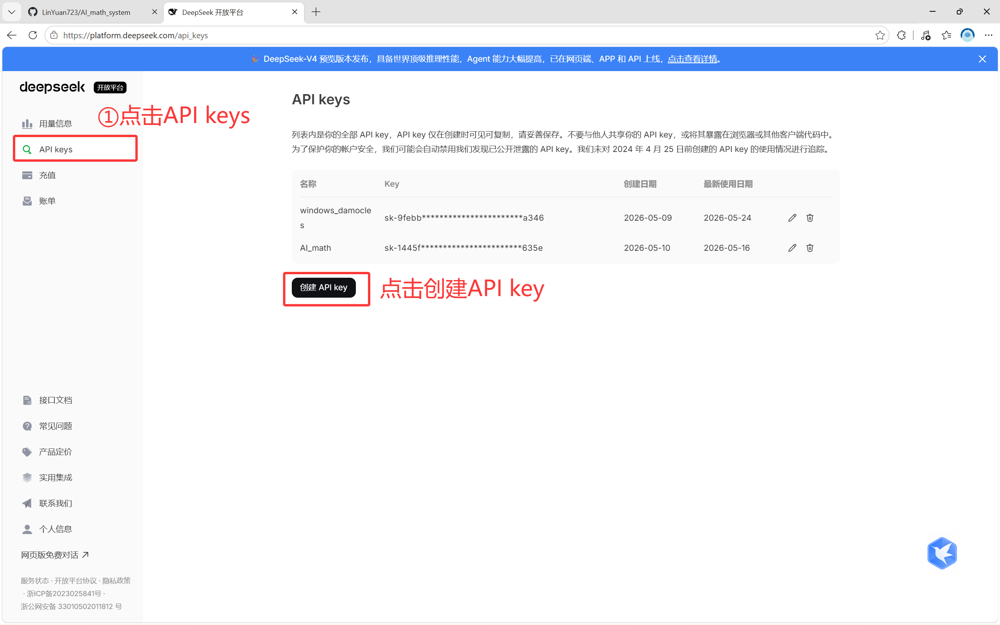

### 5.3 配置 .env 文件

1. 在项目文件夹中找到 `.env` 文件（文件名就是 `.env`，没有其他后缀）。
2. 右键点击文件，选择 **"打开方式" → "记事本"**。
3. 确认内容如下（将 `你的密钥` 替换为你在上一步复制的真实密钥）：

```
DEEPSEEK_API_KEY=sk-xxxxxxxxxxxxxxxxxxxxxxxxxxxxxxxx
DEEPSEEK_BASE_URL=https://api.deepseek.com
```

4. 保存并关闭文件。

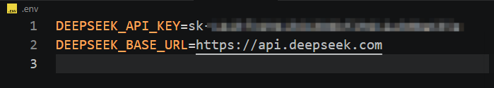

> ⚠️ **重要提示**：
> - 密钥不要分享给他人。
> - API 调用会产生费用（约 1-2 元/百万 token），建议先充值 10-20 元测试使用。
> - 一个班级的成绩分析大约消耗几分钱。

### 5.4 如果没有 .env 文件

如果项目文件夹中没有 `.env` 文件：

1. 新建一个文本文件。
2. 将上面的两行内容填入。
3. 保存时文件名为 `.env`（注意 Windows 可能会自动添加 `.txt` 后缀，需要手动删除）。保存类型选择"所有文件"。

---

## 6. 第五步：生成示例数据（推荐）

如果你还没有真实的学生成绩数据，可以先生成一份示例数据来体验系统。

### 6.1 运行示例脚本

在项目文件夹的命令提示符中输入：

```bash
python demo/create_sample_data.py
```

### 6.2 查看生成结果

运行成功后，`demo/` 文件夹下会生成一个 `sample_scores.xlsx` 文件。这个文件包含：
- 40 名学生的模拟成绩
- 24 道题目的信息
- 3 个 Sheet（考试信息、题目信息、学生成绩）

随后你可以用这个文件测试学情分析功能。

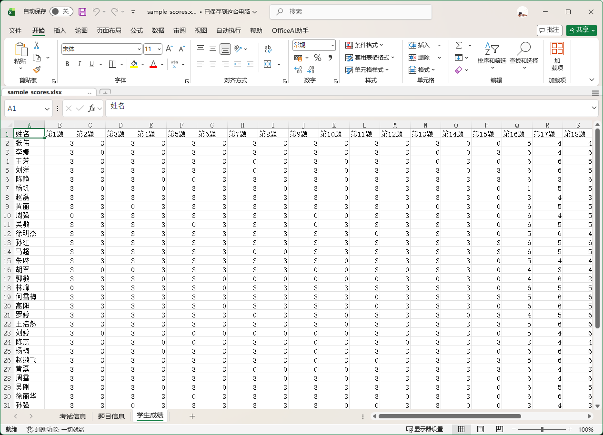

---

## 7. 第六步：启动应用

### 7.1 启动命令

**如果你使用 Anaconda**，请先激活虚拟环境：

```bash
conda activate AI_system
```

然后在项目文件夹的命令提示符中输入：

```bash
streamlit run APP.py
```

### 7.2 启动过程

命令执行后，你会看到类似下面的输出：

```
  You can now view your Streamlit app in your browser.

  Local URL: http://localhost:8501
  Network URL: http://192.168.x.x:8501
```

浏览器会自动打开 `http://localhost:8501`，显示系统主界面。


### 7.3 如果没有自动打开浏览器

手动打开浏览器，在地址栏输入 `http://localhost:8501` 并回车。


### 7.4 验证系统正常启动

如果看到以下内容，说明启动成功：
- 页面标题：**"初中数学智能信息系统"**
- 三个指标卡片：学生总数、考试记录、错题记录
- 三个功能模块卡片：学情智能分析、错题智能辅导、智能出题组卷
- 左侧边栏显示系统信息和 API 状态（绿色"已配置"）

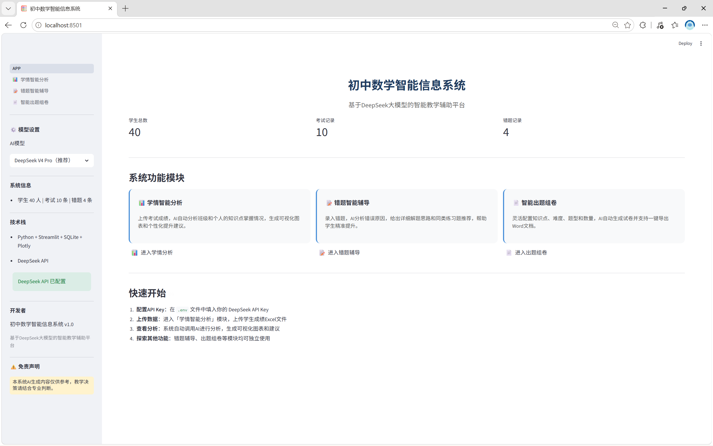

---

## 8. 第七步：停止应用

### 方式一：在命令提示符中停止

回到命令提示符窗口，按键盘 `Ctrl + C`，系统会提示确认，再次按 `Ctrl + C` 即可停止。

### 方式二：直接关闭命令提示符窗口

直接关闭黑色窗口也可以停止应用，但推荐使用方式一。

---

## 9. 常见问题排查

### Q1：启动时提示 "DeepSeek API 未配置"

**原因**：`.env` 文件未正确配置。

**解决步骤**：
1. 确认项目文件夹中存在 `.env` 文件。
2. 用记事本打开，确认 `DEEPSEEK_API_KEY=` 后面有你的真实密钥（以 `sk-` 开头）。
3. 确认文件名为 `.env`，不是 `.env.txt`（可在资源管理器中勾选"查看→文件扩展名"确认）。

### Q2：提示 "streamlit 不是内部或外部命令"

**原因**：依赖包未安装，或虚拟环境未激活。

**解决步骤**：
- **如果使用 Anaconda**：确认已执行 `conda activate AI_system`（命令行左侧应有 `(AI_system)` 前缀），然后重新执行 `pip install -r requirements.txt`。
- **如果使用直接安装的 Python**：重新执行 `pip install -r requirements.txt`。

### Q3：提示 "conda 不是内部或外部命令"

**原因**：安装 Anaconda 时没有勾选 "Add Anaconda to PATH"。

**解决步骤**：
1. 在开始菜单搜索 **"Anaconda Prompt"**，使用这个终端代替普通命令提示符（该终端已自动配置好 conda 环境变量）。
2. 在 Anaconda Prompt 中导航到项目文件夹后执行后续命令。


### Q4：AI 分析 / 生成功能报错

**可能原因**：
1. API 密钥配置错误 → 检查 `.env` 文件中密钥是否正确。
2. API 账户余额不足 → 登录 DeepSeek 平台查看余额。
3. 网络连接问题 → 检查是否能正常访问 `https://api.deepseek.com`。

### Q5：上传图片 / 使用 OCR 时报错

**原因**：`rapidocr-onnxruntime` 未正确安装。

**解决步骤**：
```bash
pip install rapidocr-onnxruntime --upgrade
```
首次使用时，OCR 模型会自动下载，可能需要几十秒时间。

### Q6：Word/PDF 导出文件打不开或乱码

**原因**：系统缺少中文字体。

**解决步骤**：
- Word 导出：确保电脑安装了宋体和黑体（Windows 系统通常自带）。
- PDF 导出：确保电脑安装了微软雅黑或黑体字体。

### Q7：Excel 上传失败

**原因**：Excel 文件格式不符合要求。

**解决步骤**：
- 确认文件包含三个必需的 Sheet：**考试信息、题目信息、学生成绩**。
- 参考 `demo/create_sample_data.py` 生成的示例文件格式。
- 确认文件扩展名为 `.xlsx` 或 `.xls`。

### Q8：端口被占用，提示 "Address already in use"

**解决步骤**：
1. 关闭之前打开的 Streamlit 应用窗口。
2. 重新执行 `streamlit run APP.py`。

### Q9：如何更新应用

1. 下载最新版本的项目文件。
2. 重新安装依赖：`pip install -r requirements.txt --upgrade`。
3. 数据库文件（`data/math_system.db`）会保留，不受更新影响。

---

## 附录：完整的依赖列表

| 包名 | 版本 | 用途 |
|------|------|------|
| streamlit | >=1.57.0 | Web 界面框架 |
| pandas | >=3.0.0 | 数据处理和 Excel 读取 |
| plotly | >=6.7.0 | 交互式图表 |
| openai | >=2.36.0 | DeepSeek API 调用 |
| python-dotenv | >=1.2.0 | 读取 .env 配置文件 |
| python-docx | >=1.2.0 | Word 文档导出 |
| fpdf2 | >=2.8.0 | PDF 文档导出 |
| rapidocr-onnxruntime | >=1.2.0 | OCR 文字识别 |
| numpy | >=2.4.0 | 数值计算 |
| Pillow | >=12.0.0 | 图像处理 |
| scipy | >=1.17.0 | 科学计算 |
| openpyxl | >=3.1.0 | Excel 文件写入 |

---

> **技术支持**：如遇到本手册未涵盖的问题，请查阅项目 README.md 或联系开发者。
