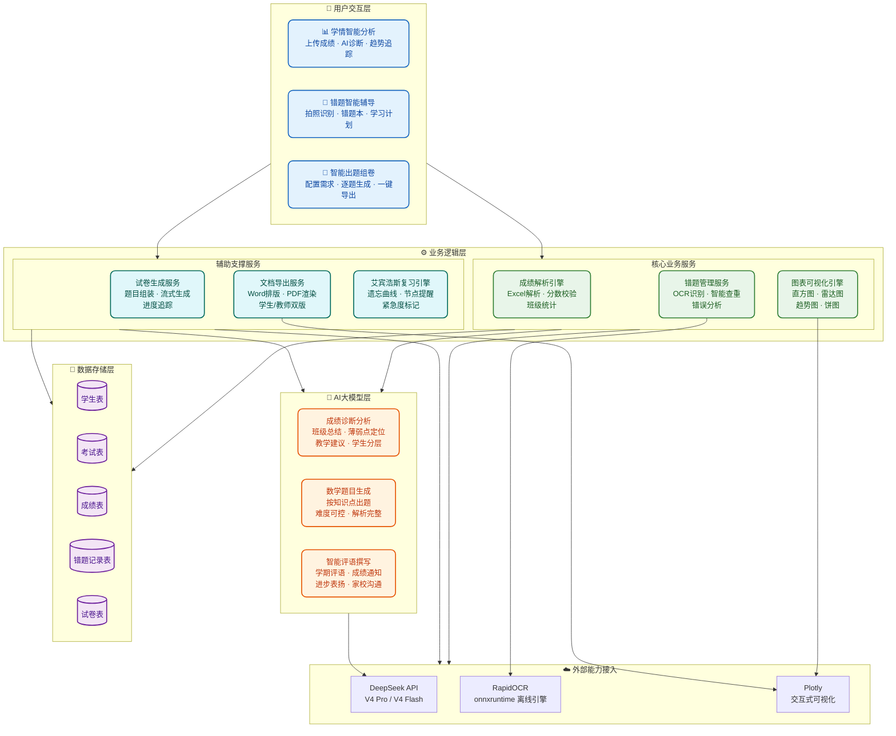
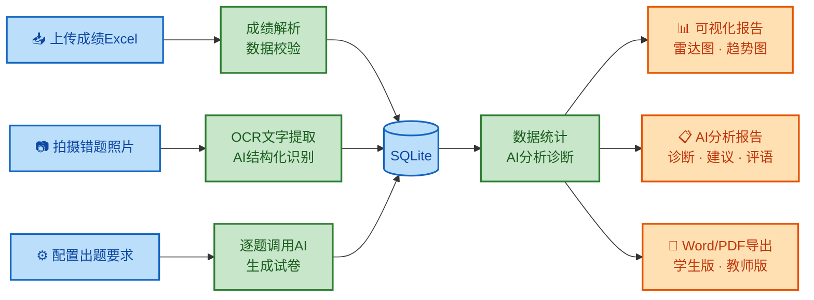

# 初中数学智能信息系统 - 架构图

## 功能架构图

```mermaid
graph TB
    %% 样式定义
    classDef frontend fill:#E3F2FD,stroke:#1565C0,stroke-width:2px,color:#0D47A1,rx:10,ry:10
    classDef business fill:#E8F5E9,stroke:#2E7D32,stroke-width:2px,color:#1B5E20,rx:10,ry:10
    classDef ai fill:#FFF3E0,stroke:#E65100,stroke-width:2px,color:#BF360C,rx:10,ry:10
    classDef data fill:#F3E5F5,stroke:#6A1B9A,stroke-width:2px,color:#4A148C,rx:10,ry:10
    classDef export fill:#E0F7FA,stroke:#00695C,stroke-width:2px,color:#004D40,rx:10,ry:10

    %% ========== 用户层 ==========
    subgraph 用户层["👤 用户交互层"]
        direction LR
        T1[📊 学情智能分析<br/>上传成绩 · AI诊断 · 趋势追踪]
        T2[📝 错题智能辅导<br/>拍照识别 · 错题本 · 学习计划]
        T3[📄 智能出题组卷<br/>配置需求 · 逐题生成 · 一键导出]
    end

    %% ========== 业务层 ==========
    subgraph 业务层["⚙️ 业务逻辑层"]
        direction TB
        
        subgraph 核心服务["核心业务服务"]
            direction LR
            B1[成绩解析引擎<br/>Excel解析 · 分数校验<br/>班级统计]
            B2[图表可视化引擎<br/>直方图 · 雷达图<br/>趋势图 · 饼图]
            B3[错题管理服务<br/>OCR识别 · 智能查重<br/>错误分析]
        end

        subgraph 辅助服务["辅助支撑服务"]
            direction LR
            B4[试卷生成服务<br/>题目组装 · 流式生成<br/>进度追踪]
            B5[文档导出服务<br/>Word排版 · PDF渲染<br/>学生/教师双版]
            B6[艾宾浩斯复习引擎<br/>遗忘曲线 · 节点提醒<br/>紧急度标记]
        end
    end

    %% ========== AI层 ==========
    subgraph AI层["🧠 AI大模型层"]
        direction LR
        A1[成绩诊断分析<br/>班级总结 · 薄弱点定位<br/>教学建议 · 学生分层]
        A2[数学题目生成<br/>按知识点出题<br/>难度可控 · 解析完整]
        A3[智能评语撰写<br/>学期评语 · 成绩通知<br/>进步表扬 · 家校沟通]
    end

    %% ========== 数据层 ==========
    subgraph 数据层["💾 数据存储层"]
        direction LR
        D1[(学生表)]
        D2[(考试表)]
        D3[(成绩表)]
        D4[(错题记录表)]
        D5[(试卷表)]
    end

    %% ========== 外部 ==========
    subgraph 外部能力["☁️ 外部能力接入"]
        direction LR
        E1[DeepSeek API<br/>V4 Pro / V4 Flash]
        E2[RapidOCR<br/>onnxruntime 离线引擎]
        E3[Plotly<br/>交互式可视化]
    end

    %% ---- 连接关系 ----
    用户层 --> 核心服务
    用户层 --> 辅助服务

    核心服务 --> AI层
    核心服务 --> 外部能力
    辅助服务 --> AI层
    辅助服务 --> 外部能力

    AI层 --> E1
    核心服务 --> 数据层
    辅助服务 --> 数据层

    B3 --> E2
    B2 --> E3
    B5 --> E3

    %% ---- 样式应用 ----
    class T1,T2,T3 frontend
    class B1,B2,B3 business
    class B4,B5,B6 export
    class A1,A2,A3 ai
    class D1,D2,D3,D4,D5 data
```

## 数据流图

```mermaid
flowchart LR
    classDef input fill:#BBDEFB,stroke:#1565C0,stroke-width:2px,color:#0D47A1
    classDef process fill:#C8E6C9,stroke:#2E7D32,stroke-width:2px,color:#1B5E20
    classDef output fill:#FFE0B2,stroke:#E65100,stroke-width:2px,color:#BF360C

    IN1[📥 上传成绩Excel]:::input --> P1[成绩解析<br/>数据校验]:::process
    P1 --> DB[(SQLite)]:::input
    
    IN2[📷 拍摄错题照片]:::input --> P2[OCR文字提取<br/>AI结构化识别]:::process
    P2 --> DB
    
    IN3[⚙️ 配置出题要求]:::input --> P3[逐题调用AI<br/>生成试卷]:::process
    P3 --> DB

    DB --> P4[数据统计<br/>AI分析诊断]:::process
    P4 --> OUT1[📊 可视化报告<br/>雷达图 · 趋势图]:::output
    P4 --> OUT2[📋 AI分析报告<br/>诊断 · 建议 · 评语]:::output
    P4 --> OUT3[📄 Word/PDF导出<br/>学生版 · 教师版]:::output
```
